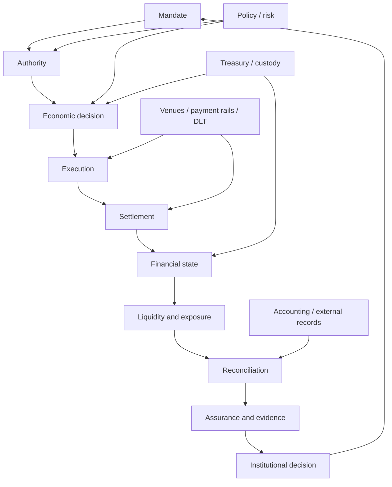

# Lifecycle diagram

```mermaid
flowchart TD
  M[Mandate] --> A[Authority]
  A --> D[Economic decision]
  D --> X[Execution]
  X --> S[Settlement]
  S --> F[Financial state]
  F --> L[Liquidity and exposure]
  L --> R[Reconciliation]
  R --> E[Assurance and evidence]
  E --> I[Institutional decision]
  I --> M
  P[Policy / risk] --> A
  P --> D
  T[Treasury / custody] --> D
  T --> F
  V[Venues / payment rails / DLT] --> X
  V --> S
  C[Accounting / external records] --> R
```
